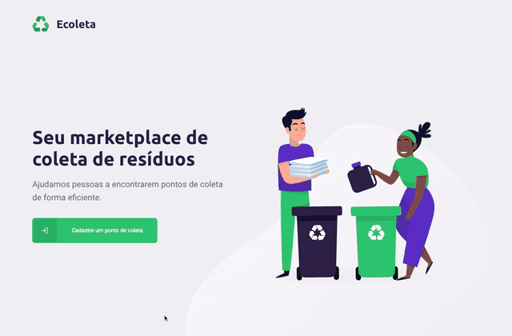

<h1 align="center">
  
</h1>

<p align="center">Project developed during Rocketseat Next Level Week #1</p>

<p align="center">
  <a href="https://github.com/frassaolucas">
    
  </a>
  
</p>

## :computer: Project

<p align="center">
  
</p>

<p>Ecoleta is an application that helps users create and find places that collect special residues such as cooking oil.</p>

### Desktop

<p align="center">
  
</p>

### Mobile

<p align="center">
  
</p>

## :rocket: Technologies Used

<ul>
  <li>
    <a href="https://nodejs.org/en/">
      Node.js
    </a>
  </li>
  <li>
    <a href="https://https://www.typescriptlang.org/">
      Typescript
    </a>
  </li>
  <li>
    <a href="https://github.com/expressjs/express">
      Express
    </a>
  </li>
  <li>
    <a href="http://knexjs.org/">
      Knex/Sqlite
    </a>
  </li>
  <li>
    <a href="https://reactjs.org/">
      React
    </a>
  </li>
  <li>
    <a href="https://reactnative.dev/">
      React Native
    </a>
  </li>
  <li>
    <a href="https://expo.io/">
      Expo
    </a>
  </li>
</ul>

## :fire: Configuring

### Backend

On your terminal, access the project folder/backend and run the following commands:

``` bash
# install all dependencies
$ npm install

# run migrates
$ npm run knex:migrate

# run seeds
$ npm run knex:seed

# start server
$ npm run dev

# running on port 3333
```

### Frontend

On your terminal, access the project folder/frontend and run the following commands:

``` bash
# install all dependencies
$ npm install

# start server
$ npm start

# running on port 3000
```

### Mobile

On your terminal, access the project folder/mobile and run the following commands:

``` bash
# install all dependencies
$ npm install

# Install Expo in your phone

# start server
$ npm start

# Expo will open. Scan QRCode with your phone
```
